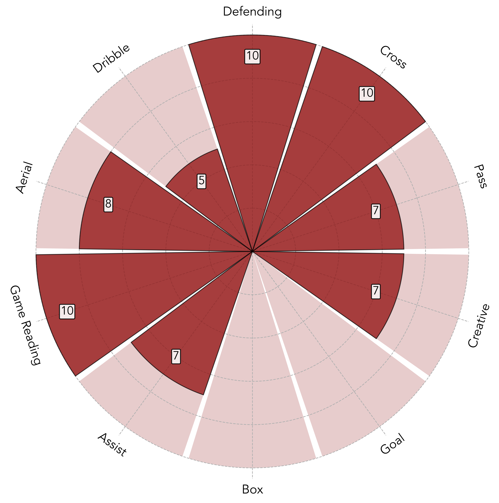
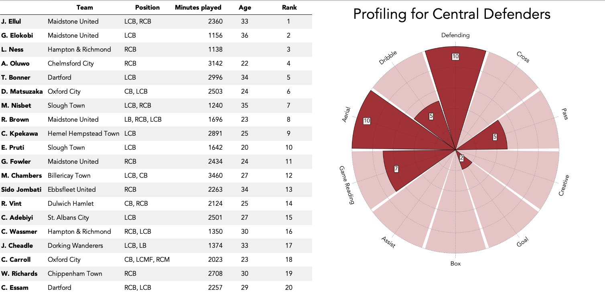

# Ranking Players using Weighted Averages

Due to the complexity of football, there is a vast number of different statistics collected in football. These range from defensive based statistics through to goal scoring statistics. To identify statistically valuable players, often players are ranked in a particular statistic to highlight the best player in a particular attribute. However, the ability of a player is not solely based on the performance in one statitsic.

How valuable a player is often attributed to their excellence in multiple areas of their game. For example, a midfielder may be judged on their ability to win possession back and additionally to retain possession. High performance in each of these attributes is usually shown in multiple different statistics, such as winning possession which can be shown in defensive duels won, aerial duels won and interceptions.

Moreover, teams play systems that require different position specific roles with contrasting attributes. For example, some teams may require one central midfielder who sits deep, breaks up play and does not venchure forward or overly contribute to build-up play. Other teams may want two compitently defensive midfielders who are equally good at bring the ball up the field and contributing to build-up play. These attributes are contained in much more than a few statistics and identifying statistically top players who fit this profile may be challenging. 

Here is presented a method identifying players using statitsics based on a bespoke profile created by the user. This method takes an input of multiple statistics from a dataset of players and reduces them all to one number for each player using a weighted average. This is then ranked to highlight the most suitable players for this position. The construction is based on a collection of weights inputed by the user which measures the importance that catagory of the player's game is to the final ranking. 

This report explains the details of this method and applies it to centre backs in the Premier League. 

*All methods in this document are not assumed to be unique, but instead showcase personal constructions used to evaluate players. Specific details of code and presentation have been created by Oliver Whaites.*

*Data used for visualisations in this document has been sourced from Wyscout.*

## Weighted Averages

Consider a dataset of size $N$. Each datapoint is scored in $n$ different catagories where the value of the score is denoted $x^{(j)}_i$ for the $i$th score in the $j$th datapoint. Although scoring each datapoint in separate catagories is good, it would be useful to combine all these scores into one score, making all the data points easier to compare. One of the simplest ways of doing this is just by taking the sum of all the scores, such that \begin{equation}
X_j = \sum_{i = 1}^{n}x_i^{(j)}
\end{equation}

## Profiling Players

## Resulting Ranking

## Final Remarks

